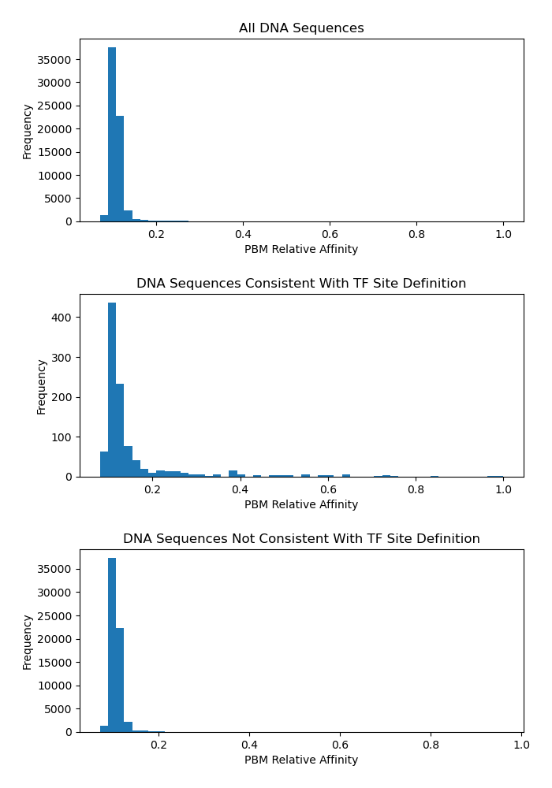

# tfsites.DefineTFBindingSites.from.PBM v1

**Author(s):** Joe Solvason, Simran Jandu

**Contact:** Joe Solvason (solvason@eng.ucsd.edu)

**Adapted as a GenePattern Module by:** Ted Liefeld (jliefeld@cloud.ucsd.edu)

**Task Type:** Transciption factor analysis

**LSID:**  urn:lsid:genepattern.org:module.analysis:00441


## Introduction

`DefineTFBindingSites.from.PBM` normalizes the median fluorescence intensity (MFI) values in a raw protein-binding microarray (PBM) data file for a transcription factor of interest. The k-mer with the maximum MFI that conforms to the binding site definition is normalized to 1.0 and all other k-mers are normalized relative to that MFI value. For example, a normalized value of 0.1 is 10% of the maximum MFI. 

## Methodology

The raw PBM dataset for a transcription factor is downloaded from [uniPROBE](http://the_brain.bwh.harvard.edu/uniprobe/) and the user indicates the columns of the forward k-mer and the MFI. The user defines the minimal binding site using IUPAC nomenclature (ie, N = ATGC, W = AT, [etc](https://genome.ucsc.edu/goldenPath/help/iupac.html)). The tool searches for the k-mer with the largest MFI signal that conforms to the IUPAC binding site definition. For all other k-mers, the MFI signal will be normalized relative to the MFI signal of the maximum k-mer and the resulting value is called the relative affinity. Therefore, the k-mer with the maximum MFI signal will have a relative affinity of 1.0. The normalization calculation for each k-mer is: relative affinity = (MFI signal) / (MFI signal of the maximum IUPAC k-mer). 

## Parameters

<span style="color: red;">*</span> indicates required parameter

### Inputs and Outputs

- <span style="color: red;">*</span> **raw PBM data (.tsv)** 
    - File containing the raw PBM dataset. This file is the output of a protein-binding microarray experiment obtained from uniPROBE. 
- <span style="color: red;">*</span>**reference relative affinity table output filename (.tsv)**
    - Name of the output file containing the normalized PBM data. 
- <span style="color: red;">*</span>**histograms of relative affinities output filename(.png)** 
    - Name of the output graph containing 3 histogram plots of the relative affinity values.
      
### Other Parameters
- <span style="color: red;">*</span>**binding site definition (string)**
    - IUPAC definition of the core transcription factor binding site (see [here](https://www.bioinformatics.org/sms/iupac.html)). The length of the IUPAC definition should be the same length k as the k-mers in the raw PBM file.
- <span style="color: red;">*</span>**column of PBM k-mers (integer)**
    - Number of the column containing the forward DNA sequence in the raw PBM file (1-indexed, 1 is the first column).
- <span style="color: red;">*</span>**column of PBM MFI (integer)**
    - Number of the column containing the median fluorescence intensity (MFI) signal in the raw PBM file (1-indexed, 1 is the first column).
- <span style="color: red;">*</span>**header present (boolean)**
    - If `True`, a header exists in the raw PBM file. If `False`, no header exists.
- **report sites only (boolean)**
    - `default = False`
    - If `True`, only report k-mers abiding by the binding site definition. If `False`, report all k-mers.
- **enforce minimum relative affinity (boolean)**
    - `default = False`
    - If `True`, enforce the relative affinities to range between 0 and 1. If `False`, the original range of the relative affinities will remain the same.
- **define highest relative affinity sequence (string)**
    - `default = None`
    - The k-mer sequence whose MFI will be used to normalize the MFI values of all other k-mers. The relative affinity for this k-mer will be 1.0. 

## Warnings Printed:

1. If there exists another k-mer that conforms to the binding site definition and has a higher MFI than one provided by the user as the **Max K-mer to Normalize**.
2. If there are any k-mers that do not conform to the binding site definition but have a MFI greater than the k-mer provided by the user. The affinities of these k-mers will be capped at 1.0.

## Input Files

1.  Raw PBM Input (.tsv)
- Columns
  - `8-mer:` every possible forward k-mer sequence with length k
  - `8-mer:` the reverse complement of the forward k-mer
  - `E-score:` the enrichment score of the k-mer
  - `Median:` the median fluorescence intensity of the k-mer
  - `Z-score:` the z-score of the k-mer

```
8-mer        8-mer        E-score     Median      Z-score
AAAAAAAA     TTTTTTTT     0.29130     2871.60     3.5965
AAAAAAAC     TTTTTTTG     0.10748     2086.00     0.3958
AAAAAAAG     TTTTTTTC     0.23656     2539.91     2.3673
AAAAAAAT     TTTTTTTA     0.21760     2434.82     1.9442
AAAAAACA     TTTTTTGT     0.19839     2407.46     1.8310
```
       
## Output Files

1. Normalized PBM data (.tsv)
- Columns
  - `PBM Kmer:` the sequence of every possible k-mer
  - `PBM Relative Affinity:` the relative affinity of each k-mer normalized to the k-mer with the highest MFI 

```
PBM Kmer     PBM Relative Affinity
AAAAAAAA     0.147
AAAAAAAC     0.107
AAAAAAAG     0.13
AAAAAAAT     0.125
AAAAAACA     0.123
```

2. Histograms of Relative Affinities (.png) 
- Histogram plots
  - All relative affinity values
  - Relative affinity values for the sequences that follow the TF binding site definition 
  - Relative affinity values for the sequences that don't follow the TF binding site definition 

   
    
  
## Example Data

[Example input data is available on github](https://github.com/genepattern/tfsites.DefineTfSites/data)
    
    
## Version Comments

- **1.0.0** (2023-01-12): Initial draft of document scaffold.
- **1.0.1** (2024-02-02): Draft completed.
- **1.0.2** (2024-05-24): Second draft completed.
