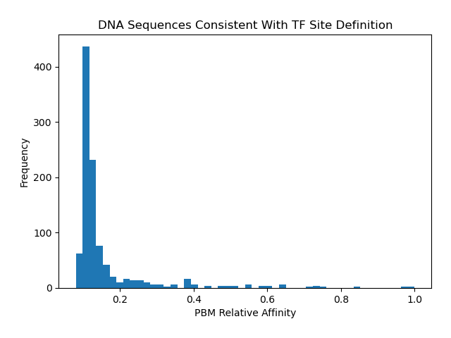

# tfsites.NormalizeTfDnaAffinityData v1

**Author(s):** Joe Solvason

**Contact:** Joe Solvason (solvason@ucsd.edu)

**Adapted as a GenePattern Module by:** Ted Liefeld (jliefeld@cloud.ucsd.edu)

**Task Type:** Transciption factor analysis

**LSID:**  urn:lsid:genepattern.org:module.analysis:00441


## Introduction

`NormalizeTfDnaAffinityData` generates a relative affinity dataset which can then be used in other TFSites modules to score binding sites. This tool normalizes a raw affinity dataset relative to the sequence with the highest value that follows the core binding site definition. The resulting dataset will report the relative affinity value for every sequence in the original dataset, ranging from 0 to 1. 

## Methodology

There is a wide range of experimental techniques that can be used to generate affinity datasets for scoring binding sites. This function can normalize any affinity dataset that has a corresponding value for each sequence. For example, raw PBM data for a transcription factor can be downloaded from [uniPROBE](http://the_brain.bwh.harvard.edu/uniprobe/). The user must indicate the columns that contain the DNA sequences and the raw affinity values. The user must also define the minimal binding site using IUPAC nomenclature (i.e. N = ATGC, W = AT, [etc](https://genome.ucsc.edu/goldenPath/help/iupac.html)). The tool searches for the k-mer with the largest value that follows the IUPAC binding site definition. For all other k-mers, their value will be normalized relative to the value of this k-mer and the resulting value is called the relative affinity. Therefore, the k-mer with the maximum value will have a relative affinity of 1.0. The normalization calculation for each sequence is: relative affinity = (value) / (value of the maximum IUPAC k-mer). For example, a relative affinity value of 0.1 is 10% of the maximum value.

## Parameters

<span style="color: red;">*</span> indicates required parameter

- <span style="color: red;">*</span> **raw data (.tsv)** 
    - File containing the raw affinity dataset. 
- <span style="color: red;">*</span>**DNA sequence column (integer)**
    - Number of the column containing the DNA sequences in the input file (1-indexed, 1 is the first column).
- <span style="color: red;">*</span>**affinity column (integer)**
    - Number of the column containing the raw affinity values in the input file (1-indexed, 1 is the first column).
- <span style="color: red;">*</span>**header present (boolean)**
    - If `True`, a header exists in the input file. If `False`, no header exists.
- <span style="color: red;">*</span>**core binding site definition (string)**
    - IUPAC definition of the core transcription factor binding site (see [here](https://www.bioinformatics.org/sms/iupac.html)). The length of the IUPAC definition should be the same length k as the k-mers in the raw affinity file.
- **output image as svg (boolean)**
    - `Default = False`
    - Option to output images as `.svg` in addition to `.png`. For manuscript preparation, `.svg` format is preferable.
- **plot resolution (integer)**
    - `Default = 200`
    - Resolution of the plot, in dots (pixels) per inch. Manuscripts require 300 DPI. The DPI does not affect the resolution of `.svg` files.
- <span style="color: red;">*</span>**output name (string)**
    - Base name of the output files.

## Input Files

1.  raw data (.tsv)
- Below is an example of raw PBM data. The only required columns are the ones containing the sequence and their corresponding raw affinity.
- Required columns
  - `8-mer:` the sequence of every forward k-mer
  - `Median:` the median fluorescence intensity (raw affinity) of the k-mer

```
8-mer        8-mer        E-score     Median      Z-score
AAAAAAAA     TTTTTTTT     0.29130     2871.60     3.5965
AAAAAAAC     TTTTTTTG     0.10748     2086.00     0.3958
AAAAAAAG     TTTTTTTC     0.23656     2539.91     2.3673
AAAAAAAT     TTTTTTTA     0.21760     2434.82     1.9442
AAAAAACA     TTTTTTGT     0.19839     2407.46     1.8310
```
       
## Output Files

1. relative affinity table (.tsv)
- Columns
  - `Kmer:` the sequence of every k-mer
  - `Relative Affinity:` the relative affinity of each k-mer normalized to the k-mer with the highest raw affinity 

```
Kmer         Relative Affinity
AAAAAAAA     0.15
AAAAAAAC     0.11
AAAAAAAG     0.13
AAAAAAAT     0.13
AAAAAACA     0.12
```

2. histogram of relative affinities (.png) 

   
    
  
## Example Data

Example input data is available at [here](https://github.com/genepattern/tfsites.DefineTfBindingSitesFromPBM/tree/develop/data).
    
    
## Version Comments

- **1.0.4** (2024-11-21): Updated for tfsites website.
- **1.0.3** (2024-10-17): Third draft completed.
- **1.0.2** (2024-05-24): Second draft completed.
- **1.0.1** (2024-02-02): Draft completed.
- **1.0.0** (2023-01-12): Initial draft of document scaffold.
